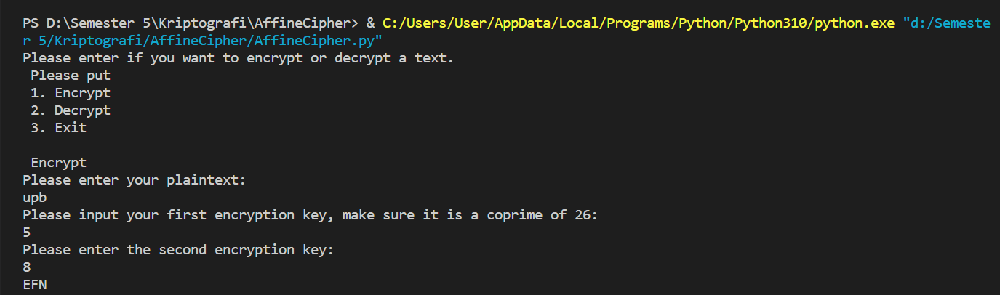

# AffineCipher

<strong>Repository ini dibuat untuk memenuhi tugas Kriptografi</strong>
| <strong>Nama</strong> | <strong>Riris Naomi Gurning</strong> |
| ----------- | ----------- |
| <strong>NIM</strong> | <strong>312010190</strong> |
| <strong>Kelas</strong> | <strong>TI.20.A.1</strong> |

# Enkripsi Playfair Chiper pada Plaintext:

1. <strong>AffineCipher</strong>: Akan mengambil input untuk diverifikasi. Pada input yang salah, pesan kesalahan harus dikembalikan. Jika semua input diterima, pesan terenkripsi harus dikembalikan dalam huruf kapital. Hanya huruf dan spasi yang disimpan, sisanya dibuang.
<strong>BreakAffineCipher</strong>: Akan mengambil teks terenkripsi sebagai input. Membandingkan hasil yang mungkin dengan daftar kata bahasa Inggris untuk memprediksi hasil yang paling mungkin, menggunakan sistem pembobotan untuk lebih menghargai kata yang lebih panjang. Itu dibuat dengan fokus pada efisiensi dan pengaturan waktu.

2. Dengan kata plaintext "upb" dengan first encrypt key "5" dengan second encrypt key "8" Ini hasil dari kode tersebut 
   
